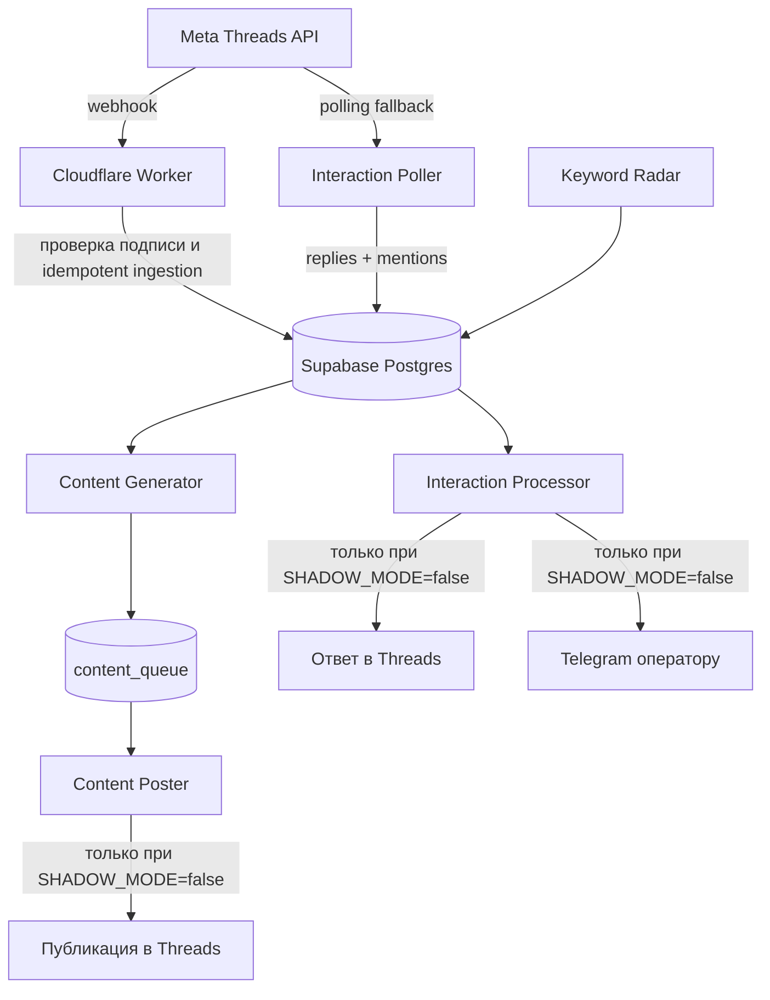
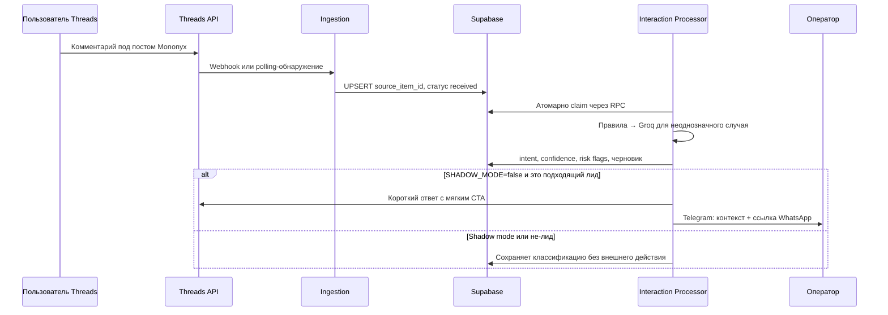

<div align="center">

# Threads Lead Bot

### Growth-движок для Threads аккаунта Mononyx

Находит интерес к услугам агентства, бережно отвечает на подходящие комментарии
и передаёт тёплые диалоги человеку — без постоянного сервера и платной инфраструктуры.

[](https://supabase.com/)
[](https://workers.cloudflare.com/)
[](https://deno.com/)
[](https://developers.facebook.com/docs/threads)
[](#режимы-работы)

[Архитектура](#архитектура) · [Запуск](#запуск) · [Контент](#контент) · [Проверка](#проверка) · [Безопасность](#безопасность)

</div>

> [!IMPORTANT]
> По умолчанию внешние действия выключены: `SHADOW_MODE=true`. Бот может собирать, классифицировать и готовить черновики, но не публикует посты, не отвечает в Threads и не отправляет Telegram-уведомления. Перевод в активный режим — только отдельным решением владельца после проверки примеров.

## Что делает бот

Threads Lead Bot — не автономный продавец. Он помогает Mononyx быстрее заметить и квалифицировать интерес к услугам: сайтам, лендингам, мобильным приложениям и AI-автоматизации.

| Сценарий | Поведение |
| --- | --- |
| Комментарий под своим постом | Сохраняет событие, оценивает намерение и готовит короткий уместный ответ. |
| Упоминание аккаунта | Принимает через webhook или polling, затем отправляет в общую очередь. |
| Коммерческая фраза в чужом посте | Keyword Radar находит публикацию и передаёт её оператору. Автоответов под чужими постами нет. |
| Контент-план | Создаёт и публикует посты из очереди двумя шагами: container → publish. |
| Тёплый лид | После разрешённого ответа в Threads отправляет оператору Telegram-уведомление с контекстом и ссылкой WhatsApp. |

Бот не обещает позиции в поиске, сроки, продажи, ROI или результаты, которые нельзя подтвердить. Он также не придумывает цифры для кейсов и не ведёт сделку вместо человека.

## Архитектура



### Доставка комментариев: два независимых пути

Основной путь — webhook Meta → Cloudflare Worker. Worker проверяет `X-Hub-Signature-256` по исходным байтам запроса, нормализует событие и вставляет его в базу без повторов.

Если Meta не доставила webhook, `interaction-poller` раз в пять минут читает ответы к последним пяти собственным постам и до 50 упоминаний через официальный Threads API. Оба пути используют один ключ дедупликации:

```text
reply:<id>
mention:<id>
keyword_search:<id>
```

Поэтому повторная доставка или пересечение polling и webhook не создаёт второй лид. Обычная задержка polling-сценария — до пяти минут плюс время следующего запуска процессора.

## Стек

| Слой | Технология | Зона ответственности |
| --- | --- | --- |
| Приём webhook | Cloudflare Workers | Подпись Meta, нормализация и быстрая запись события. |
| База и очереди | Supabase Postgres | Таблицы, RLS, дедупликация, leases, retry и RPC-claim. |
| Фоновые задачи | Supabase Edge Functions + Cron | Polling, обработка лидов, генерация и публикация контента, keyword radar. |
| Интеллект | Groq | Классификация неоднозначных событий и черновики в рамках профиля бренда. |
| Оператор | Telegram Bot API | Уведомления о подходящих лидах. |
| Ручной резерв | Python + GitHub Actions | Только `workflow_dispatch`; не нужен для постоянной работы бота. |

Система не требует постоянно включённого Mac и не зависит от планового GitHub Actions.

## Структура репозитория

```text
.
├── worker/                         # Cloudflare Worker и интеграционные тесты
├── supabase/
│   ├── functions/                  # Edge Functions на TypeScript / Deno
│   │   ├── interaction-poller/
│   │   ├── interaction-processor/
│   │   ├── content-generator/
│   │   ├── content-poster/
│   │   └── keyword-radar/
│   ├── migrations/                 # История изменений БД
│   ├── schema.sql                  # Полная схема, RLS и RPC очередей
│   ├── verify_security.sql         # Проверка RLS, grants и прав RPC
│   ├── cron_setup.sql              # Расписание Supabase Cron
│   └── seed_content_profile.sql    # Профиль бренда и контент-правила
├── bot/                            # Ручной Python-резерв
├── config/keywords.json            # Фразы для Keyword Radar
├── tests/                          # Python-тесты
└── .github/workflows/              # Ручной CI и резервные workflow
```

## Поток обработки лида



### Правила очередей

- Очереди выдаются только через `claim_interactions` и `claim_due_content` с `FOR UPDATE SKIP LOCKED`.
- Незавершённая обработка возвращается в работу после истечения lease.
- Повторные попытки используют exponential backoff `2^attempts` минут; после лимита запись попадает в `dead_letter`.
- Публикация контента всегда двухэтапная: сначала сохраняется `container_id`, затем выполняется publish. Это уменьшает риск двойного создания container после сбоя.

## Контент

Контент-генератор пишет по профилю Mononyx на русском языке для малого и среднего бизнеса Казахстана. Голос — от лица человека, а не безличной компании: коротко, конкретно и без искусственно гладкого «ИИ-тона».

### Услуги и стартовые цены

| Услуга | Формулировка |
| --- | --- |
| Лендинг | от 49 990 ₸ |
| Многостраничный сайт | от 89 990 ₸ |
| WhatsApp / Telegram-бот | от 200 000 ₸ |
| Мобильное приложение | стоимость после обсуждения задачи |

### Как строятся посты

- Лёгкий вход в разговор: выбор из двух вариантов, знакомая боль, короткий спорный тезис или вопрос о личном опыте.
- Хук соответствует содержанию поста. Кликбейт запрещён.
- Один пост — одна проблема, одна связанная с ней услуга и один простой вопрос по задаче потенциального клиента.
- Длина — от 70 до 170 символов: одна или две короткие фразы без профессионального жаргона.
- Пост коротко называет, что команда собирает, упрощает, проектирует или настраивает в рамках одной услуги.
- Финальный вопрос должен запускать разговор и помогать квалифицировать задачу. Общие вопросы «что думаете?» и «согласны?» запрещены.
- Личный кейс, результат или число используются только если они явно подтверждены профилем бренда. Бот не генерирует метрики, сроки и достижения самостоятельно.
- Нет обещаний топа Google, гарантированных заявок, сроков, ROI и скрытых расходов.
- Никаких прямых «пишите в WhatsApp/директ» в автопостах: комментарии дают материал для аккуратной квалификации.

Автоответ отправляется только на явный коммерческий запрос или конкретный вопрос об услуге, цене, сроке или связи. Шутки, сарказм, мнения, критика и обычные реакции считаются вовлечением и остаются без ответа.

Планируется 12 слотов ежедневно по времени Алматы (UTC+5): каждые два часа с **00:00** до **22:00**. В базе это нечётные часы UTC: `01:00`, `03:00`, …, `23:00`.

Генератор готовит очередь на 14 дней и берёт недавние публикации в контекст, чтобы не повторять подряд тему и тип хука.

## Режимы работы

| Режим | Что происходит |
| --- | --- |
| `SHADOW_MODE=true` | Ингест, классификация и черновики работают. Внешних ответов, Telegram-уведомлений и публикаций нет. |
| `SHADOW_MODE=false` | Разрешённые сценарии могут ответить под собственным постом, уведомить оператора и опубликовать контент из очереди. Keyword Radar всё равно не отвечает под чужими постами. |

Перед отключением shadow mode соберите и разметьте реальные примеры: что является лидом, что engagement, что spam и где ответ действительно уместен.

## Запуск

### 1. Supabase: схема и защита

Создайте проект Supabase и примените актуальную схему из [`supabase/schema.sql`](supabase/schema.sql). Затем обязательно выполните [`supabase/verify_security.sql`](supabase/verify_security.sql) в SQL Editor: этот скрипт не изменяет данные, а завершится ошибкой, если RLS, grants или права RPC настроены неверно.

Для работы с проектом локально:

```bash
npx supabase login
npx supabase link --project-ref <project-ref>
npx supabase db push
```

Профиль контента загружается из [`supabase/seed_content_profile.sql`](supabase/seed_content_profile.sql). Не помещайте ключи проекта или токены в SQL-файлы и коммиты.

### 2. Cloudflare Worker: webhook и OAuth callback

Для Worker нужен Node.js 24+.

В каталоге `worker/` установите зависимости и добавьте секреты через интерактивный ввод:

```bash
cd worker
npm ci
npx wrangler secret put META_APP_SECRET
npx wrangler secret put META_WEBHOOK_VERIFY_TOKEN
npx wrangler secret put SUPABASE_URL
npx wrangler secret put SUPABASE_SERVICE_ROLE_KEY
npx wrangler deploy
```

После deploy укажите в Meta URLs развёрнутого Worker:

| Назначение | URL |
| --- | --- |
| Webhook callback | `https://<worker>.<account>.workers.dev/webhook` |
| OAuth redirect | `https://<worker>.<account>.workers.dev/oauth/callback` |
| Deauthorize callback | `https://<worker>.<account>.workers.dev/oauth/deauthorize` |
| Data deletion callback | `https://<worker>.<account>.workers.dev/data-deletion` |

Для проверки webhook Meta использует тот же `META_WEBHOOK_VERIFY_TOKEN`, который задан как Cloudflare Secret. `LOG_WEBHOOK_PAYLOADS` оставляйте выключенным; временно включать его можно только для короткой диагностики настоящего тестового события и без сохранения raw payload.

### 3. Supabase Edge Functions: секреты и deploy

Создайте локальный файл `supabase/.env.functions` по примеру [`.env.example`](.env.example). Файл игнорируется Git и остаётся только на вашей машине.

```dotenv
CRON_SECRET=<случайная строка длиной не менее 32 символов>
THREADS_ACCESS_TOKEN=<токен Threads тестера или рабочего аккаунта>
THREADS_USER_ID=<id аккаунта Threads>
GROQ_API_KEY=<ключ Groq>
GROQ_MODEL=<модель Groq>
TELEGRAM_BOT_TOKEN=<токен бота>
TELEGRAM_CHAT_ID=<id чата оператора>
WHATSAPP_CONTACT_LINK=https://wa.me/<номер_без_plus>
SHADOW_MODE=true
OWN_THREADS_USERNAME=<username без @>
CONTENT_GENERATION_BATCH_SIZE=7
```

Загрузите секреты и разверните функции:

```bash
npx supabase secrets set --env-file supabase/.env.functions

npx supabase functions deploy interaction-poller --no-verify-jwt
npx supabase functions deploy interaction-processor --no-verify-jwt
npx supabase functions deploy content-generator --no-verify-jwt
npx supabase functions deploy content-poster --no-verify-jwt
npx supabase functions deploy keyword-radar --no-verify-jwt
```

`SUPABASE_URL` и `SUPABASE_SERVICE_ROLE_KEY` в хостинговых Edge Functions предоставляет Supabase. Service role никогда не попадает во frontend, Telegram, Threads, лог или README.

У этих внутренних функций встроенная JWT-проверка отключена намеренно: каждый endpoint принимает только `POST` с заголовком `x-cron-secret`, который сверяется с `CRON_SECRET` в постоянном времени. Не передавайте этот секрет через URL, не публикуйте его и не заменяйте эту проверку открытым endpoint.

### 4. Supabase Vault и Cron

Перед применением [`supabase/cron_setup.sql`](supabase/cron_setup.sql) добавьте в Supabase Vault два секрета:

| Vault secret | Значение |
| --- | --- |
| `project_url` | `https://<project-ref>.supabase.co` |
| `cron_secret` | То же значение, что и `CRON_SECRET` у Edge Functions |

После этого выполните `supabase/cron_setup.sql` в SQL Editor. Расписание намеренно смещено от круглых минут:

| Задача | Cron | Назначение |
| --- | --- | --- |
| Interaction Poller | `1,6,11,16,21,26,31,36,41,46,51,56 * * * *` | Резервный сбор replies и mentions. |
| Interaction Processor | `2,7,12,17,22,27,32,37,42,47,52,57 * * * *` | Классификация, retries и разрешённые действия. |
| Content Generator | `39 */6 * * *` | Пополнение очереди публикаций. |
| Content Poster | `0 1,3,5,7,9,11,13,15,17,19,21,23 * * *` | Публикация готовых записей каждые два часа: `00:00, 02:00, …, 22:00` по Алматы (UTC+5). |
| Keyword Radar | `23 */3 * * *` | Поиск коммерческих публикаций и операторский алерт. |

Для безопасной паузы всех задач используйте [`supabase/cron_teardown.sql`](supabase/cron_teardown.sql). Не удаляйте таблицы или секреты ради остановки Cron.

### Ручной резерв через GitHub Actions

Workflow в [`.github/workflows/`](.github/workflows/) — это резервный способ запустить Python-задачи вручную через `workflow_dispatch`. Он не участвует в постоянной работе бота. Если используете резерв, храните его секреты только в GitHub Secrets и не дублируйте их в коде.

### 5. Meta и Threads

1. Добавьте аккаунт Threads в роль **Threads Tester** и примите приглашение в настройках разрешений аккаунта Threads.
2. Включите нужные разрешения use case `Access the Threads API`: `threads_basic`, `threads_content_publish`, `threads_keyword_search`, `threads_manage_mentions`, `threads_manage_replies`, `threads_read_replies`.
3. В разделе **Webhooks with Threads** добавьте callback URL Worker, verify token и подпишитесь на `replies` и `mentions`.
4. Сначала выполните проверку на тестовом посте и комментарии при `SHADOW_MODE=true`.

## Проверка

Документационные изменения не заменяют проверку кода. Перед изменением соответствующей подсистемы используйте нужный набор команд.

### Python-резерв

```bash
python3 -m compileall -q bot tests
python3 -m unittest discover -s tests -v
```

### Edge Functions

```bash
deno fmt --check supabase/functions
deno task --config supabase/functions/deno.json check
deno task --config supabase/functions/deno.json test
```

### Cloudflare Worker

```bash
cd worker
npm ci
npm run typecheck
npm test
npm run deploy:dry
```

### Минимальный smoke test

1. Оставьте `SHADOW_MODE=true`.
2. Опубликуйте API-видимый пост в Threads и напишите под ним комментарий тестовым аккаунтом.
3. Проверьте в `interactions` одну запись с ожидаемым `source_item_id` и статусом после обработки.
4. Убедитесь, что во время shadow mode не появилось внешнего ответа, публикации или Telegram-сообщения.
5. После разметки достаточного числа реальных примеров отдельно решите, можно ли включать внешние действия.

## Безопасность

- Webhook-подпись Meta проверяется **до** JSON-разбора и по raw body.
- Повторное событие не меняет готовую запись: используется `INSERT ... ON CONFLICT DO NOTHING`.
- `anon` и `authenticated` закрыты по default-deny; прикладной серверный доступ имеет только `service_role`.
- Все секреты находятся в Cloudflare Secrets, Supabase Edge Function Secrets или GitHub Secrets для ручного резерва.
- Не отправляйте токены, пароли, service role key или содержимое `.env.functions` в чат, issue, commit и логи.
- После любых изменений RLS, grants или RPC запускайте `supabase/verify_security.sql`.

## Полезные ссылки

- [Threads API — документация Meta](https://developers.facebook.com/docs/threads)
- [Threads API — changelog](https://developers.facebook.com/docs/threads/changelog)
- [Supabase Edge Functions](https://supabase.com/docs/guides/functions)
- [Supabase Cron](https://supabase.com/docs/guides/cron)
- [Cloudflare Workers](https://developers.cloudflare.com/workers/)

---

<div align="center">
  <sub>Mononyx · Threads Lead Bot · Сделано для аккуратного поиска интереса, а не для спама.</sub>
</div>
